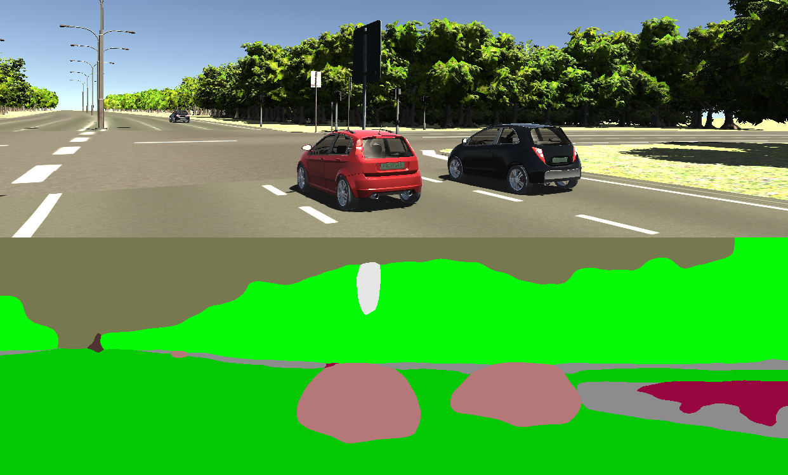
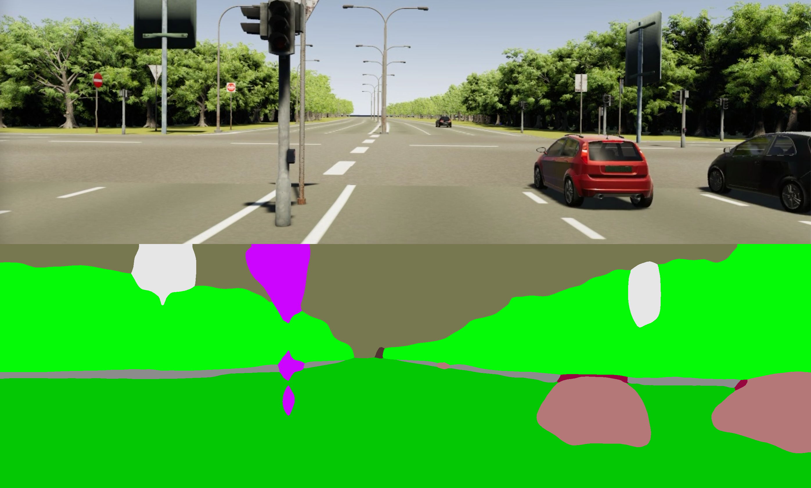

# Training Note
## Sections
This trial version of this [jupyter notebook](https://colab.research.google.com/drive/1zOJ8YydPx3a-cLl8nwKA7M66eJ5DhlSU?usp=sharing) was designed for a further formal implement.
It contains five sections up to now, which is,
1. Hardware Setup
2. 3D-SDN Example
3. Semantic Training
4. Geometry Training
5. Textural Training
   
## Running Time Estimation
The test is operated on a Colab Pro virtual machine with the following performance,

```
NAME="Ubuntu"
VERSION="18.04.5 LTS (Bionic Beaver)"
ID=ubuntu
ID_LIKE=debian
PRETTY_NAME="Ubuntu 18.04.5 LTS"
VERSION_ID="18.04"
HOME_URL="https://www.ubuntu.com/"
SUPPORT_URL="https://help.ubuntu.com/"
BUG_REPORT_URL="https://bugs.launchpad.net/ubuntu/"
PRIVACY_POLICY_URL="https://www.ubuntu.com/legal/terms-and-policies/privacy-policy"
VERSION_CODENAME=bionic
UBUNTU_CODENAME=bionic
time: 463 ms (started: 2022-03-03 00:50:28 +00:00)
```

and equipped a Nvidia GPU card ```Tesla P100``` (Colab Pro only),
```
==================== Nvidia Driver ====================
Thu Mar  3 23:16:21 2022       
+-----------------------------------------------------------------------------+
| NVIDIA-SMI 460.32.03    Driver Version: 460.32.03    CUDA Version: 11.2     |
|-------------------------------+----------------------+----------------------+
| GPU  Name        Persistence-M| Bus-Id        Disp.A | Volatile Uncorr. ECC |
| Fan  Temp  Perf  Pwr:Usage/Cap|         Memory-Usage | GPU-Util  Compute M. |
|                               |                      |               MIG M. |
|===============================+======================+======================|
|   0  Tesla P100-PCIE...  Off  | 00000000:00:04.0 Off |                    0 |
| N/A   38C    P0    28W / 250W |      0MiB / 16280MiB |      0%      Default |
|                               |                      |                  N/A |
+-------------------------------+----------------------+----------------------+
```
Since the code is runnning on a allocated virtual machine, each dependencies should be recover/initialized each time.
The running time estimation is listed as below, the  ```Hardware Setup```, ```3D-SDN Example/Download vkitti datasets``` sections are necessary for each running. 
For example, if I want to train ```MaskRCNN```, I need to complete at least the steps before ```Download vkitti datasets```. All dependency packages and data need to be built from scratch.
|                                             | Test Running Time | Real Running Time       | Notes                                                                |
|---------------------------------------------|-------------------|-------------------------|----------------------------------------------------------------------|
| **Hardware Setup**                          |                   |                         |                                                                      |
|&nbsp; Original Cuda and Nvidia drivers      | 0.4s              | 0.4s                    |                                                                      |
|&nbsp; Install Mini-conda                    | 21.9s             | 21.9s                   |                                                                      |
|&nbsp; Updating Conda to Python 3.6          | 12min 38.6s       | 12min 38.6s             |                                                                      |
|&nbsp; Downgrade CUDA (nvcc) from 11.0 to 9.0| 2min 45.3s        | 2min 45.3s              |                                                                      |
| Subtotal (A)                                | **15min 46s**     | **15min 46s**           |                                                                      |
| **3D-SDN Example**                          |                   |                         |                                                                      |
|&nbsp; Semantic Branch                       | 41.1s             | 0s                      | Not neccesary                                                        |
|&nbsp; Download vKITTI datasets              | 19min 51s         | 19min 51s               | _Download speed varied_                                              |
|&nbsp; Download vKITTI 2 datasets            | 8min 51s          | 8min 51s                | _Download speed varied_                                              |
|&nbsp; Geometric Branch                      | 57.5s             | 0s                      | Not neccesary                                                        |
|&nbsp; Textural Branch                       | 10.6s             | 0s                      | Not neccesary                                                        |
|&nbsp; Benchmark                             | 19min 5s          | 0s                      | Not neccesary                                                        |
| Subtotal (B)                                | **49min 36s**     | **28min 40s**           |                                                                      |
| **Semantic Training**                       |                   |                         |                                                                      |
|&nbsp; Train                                 | 1h 20min          | ~270.8h (11days)        | Test: 10 Epochs 60 Iteration<br>Real: 25 Epochs 5000 Iteration.      |
|&nbsp; Evaluation                            | 6min 7s           | ~21.26h                 | Test: 100 images<br>Real: 21260 (guess)                              |
|&nbsp; Test                                  | 6.8s              | ~8h                     | Test: 1 image<br>Real: 4252 (guess, 20% of total)                    |
| Subtotal (C)                                | **1h 26min**      | **~300.06h (12.5days)** |                                                                      |
| **Geometry Training**                       |                   |                         |                                                                      |
|&nbsp; MaskRCNN-Train                        | ~8h               | ~3days (80h)            | Test: 1 Epoch<br>Real: 10 Epochs                                     |
|&nbsp; Derender3D<br />Pre-training          | NA                | NA                      |                                                                      |
|&nbsp; Fine-tuning                           | NA                | NA                      |                                                                      |
|&nbsp; Testing                               |                   |                         |                                                                      |
| Subtotal (D)                                |                   |                         |                                                                      |
| **Textural Training**                       |                   |                         |                                                                      |
|&nbsp; Train                                 | NA                | NA                      |                                                                      |
|&nbsp; Test                                  | NA                | NA                      |                                                                      |
| Subtotal (E)                                |                   |                         |                                                                      |
| Total (A+B+C+D+E)                           |                   |                         |                                                                      |


## Empirical Knowledge
### Colab Pro vs SDSC HPC *Expense*
Colab Pro is a very easy to get started with Cloud Services VM, although it requires reinstalling the graphics driver, conda, and Python every time you run it. 
But the Colab Pro has a serious but understandable flaw - the maximum continuous run time is only **24** hours. This means that I must complete each test in the above table within each 24-hour interval.

As shown in the table above, if we need to retrain the data for vKITTI, Cityscape and vKITTI2, a maximum run time of **12** days is required, with a maximum continuous run time of **11** days.
(accept lower accuracy, this time could perhaps be cut in half)

So naturally, I tried creating a virtual machine on SDSC HPC *Expense* as well to see if it would run faster, since *Expense* provides four NVIDIA V100 SMX2 GPU graphics cards per node.
But like all HPCs, DSC HPC *Expense* has a queuing mechanism, meaning you can only get the VMs you request when you get in line for your spot.  I test the following two command:
```
galyleo launch --account myID --partition gpu-shared --cpus 1 --memory 16 --time-limit 1:00:00 --env-modules cpu,gcc,anaconda3 --gpus 1
```
which means I required `1` GPU with `16`GB memory for `1`hour in `gpu-shared` mode.
```
galyleo launch --account myID --partition gpu-shared --cpus 1 --memory 16 --time-limit 24:00:00 --env-modules cpu,gcc,anaconda3 --gpus 4
```
which means I required `4` GPU with `16`GB memory for `24`hour in `gpu-shared` mode.

The result of the real test is that the first command gets the computing resources I want almost immediately, while the second command can't line up the resources I want even after waiting for an hour. 
And if I extend the request length to 12 days, I am afraid that the maximum connection length limit will be exceeded.

### Can we borrow the vKITTI's pre-trained model when processing vKITTI 2?

The short and cheerful answer is yes. 
The following images are two semantic generated by executing ``python vkitti_test.py ``(described in 3D-SDN/semantic/README.md) from a low-precision model obtained in the *MaskRCNN-Train* step.



