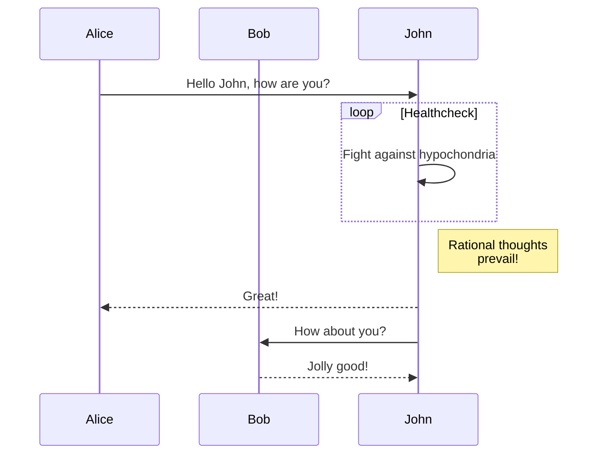

# Explainable AI Testbed

## Testbed
1. Datasets
2. Creating Model
3. Running Model
4. Result
5. Explainable Method
6. Interpreting result

```mermaid
sequenceDiagram
    participant Alice
    participant Bob
    Alice->>John: Hello John, how are you?
    loop Healthcheck
        John->>John: Fight against hypochondria
    end
    Note right of John: Rational thoughts <br/>prevail!
    John-->>Alice: Great!
    John->>Bob: How about you?
    Bob-->>John: Jolly good!
```